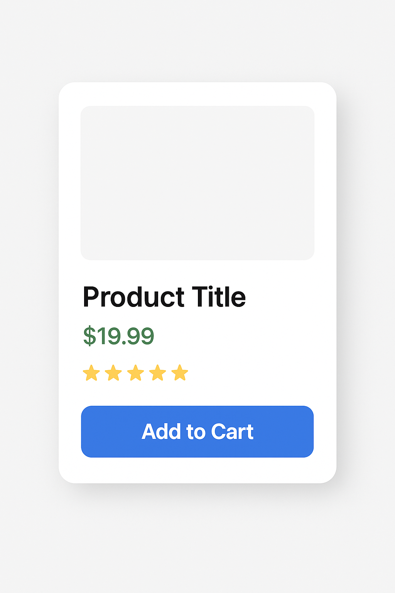
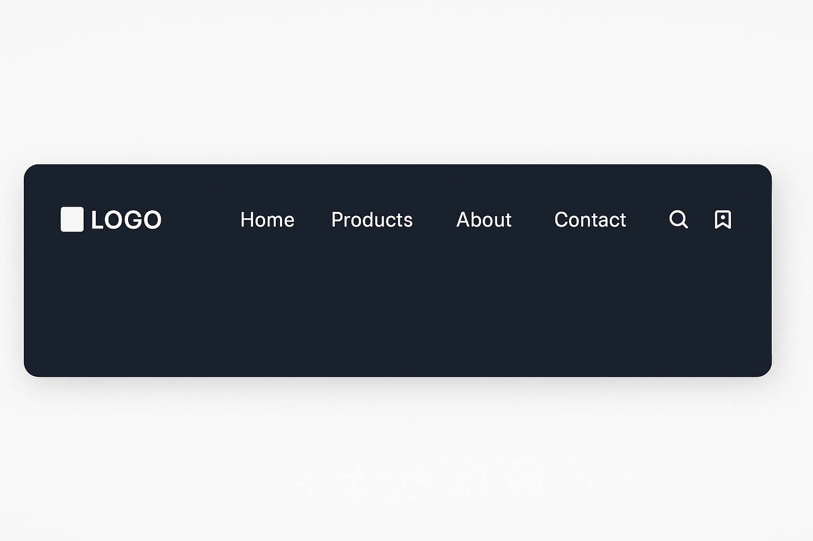
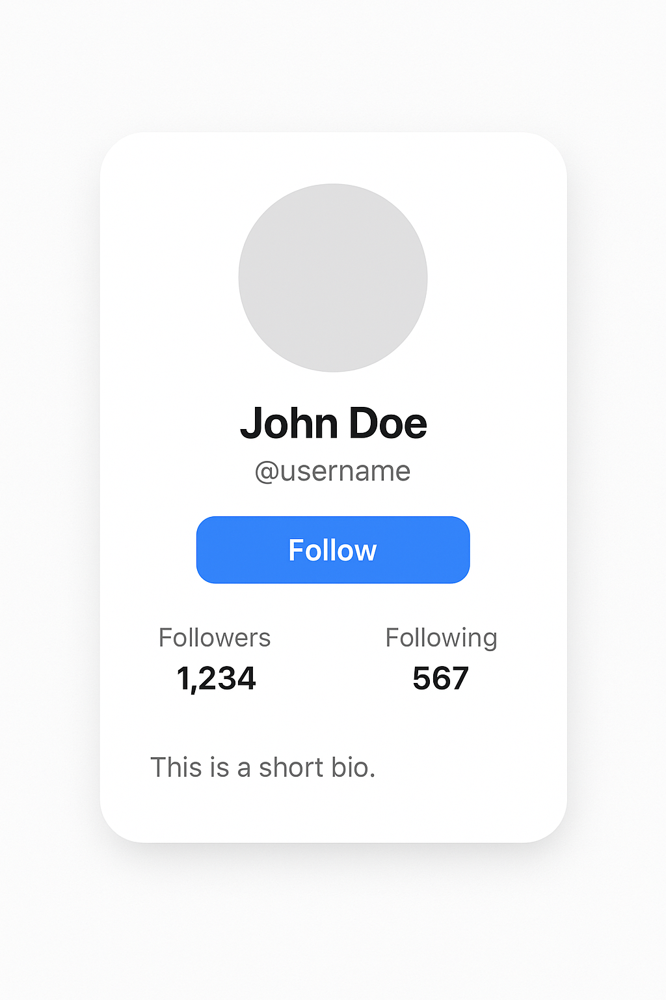

# Componentes visuales con Tailwind - Sesión Práctica

## Acuerdos de clase 🤝
- Ser amable
- Trabajar en equipo
- Pedir ayuda cuando la necesites
- Respetar los tiempos

## 🎯 Objetivos de la sesión
- Dominar las utilidades de Tailwind para diseño visual
- Imitar componentes populares usando solo Tailwind
- Crear cards, botones, formularios y navbar profesionales
- Desarrollar el ojo para traducir diseños a código
- Practicar la metodología "ver → analizar → construir"

## Actividad inicial 🎮
Cuéntanos...
¿Cuál es tu página web favorita y qué elementos visuales te llaman más la atención de ella?

## ⚡ Repaso ultra rápido - Utilidades esenciales
**No vamos a memorizar, solo tener la referencia:**

### Espaciado y tamaños:
- `p-4, m-2, w-full, h-64, max-w-sm`

### Colores y fondos:
- `bg-blue-500, text-white, border-gray-300`

### Flexbox y Grid:
- `flex, items-center, justify-between, grid, grid-cols-3`

### Efectos:
- `shadow-lg, rounded-lg, hover:bg-blue-700, transition`

**¡Ahora a practicar! 🚀**

## 📋 ¿Qué haremos hoy? - Plan de la sesión

### 🎯 **Objetivo principal:**
Transformarte en una **"traductora visual"** - ver cualquier diseño y saber exactamente cómo crearlo con Tailwind CSS.

### 🛠️ **Metodología de trabajo:**
- **5 min** analizar diseño → **15 min** construir → **5 min** compartir resultados
- Trabajo en **desafíos progresivos** que van aumentando en complejidad
- **Aprendizaje activo**: más tiempo programando que escuchando teoría

### 🎨 **Componentes que dominarás:**
1. **Cards de producto** (como Amazon, MercadoLibre)
2. **Navbar moderno** (como Netflix, Spotify)
3. **Formularios elegantes** (como Gmail, LinkedIn)
4. **Cards de perfil** (como Instagram, Twitter)
5. **Dashboard completo** (combinando todo)

### 🏆 **Al final de la sesión podrás:**
- Mirar cualquier componente web y **recrearlo** con Tailwind
- **Analizar** diseños como una desarrolladora profesional
- **Combinar** componentes para crear interfaces completas
- Tener tu **primera librería personal** de componentes

---

## 🧩 Recordatorio: ¿Qué es un componente?

### 💡 **Definición simple:**
Un componente es una **"pieza de LEGO digital"** - una parte de la interfaz que puedes **reutilizar** en diferentes lugares.

### 🏠 **Analogía de la casa:**
Si tu aplicación web fuera una casa:
- **Componentes** = Ladrillos, ventanas, puertas
- **Páginas** = Habitaciones completas
- **Aplicación** = La casa entera

### 🎯 **¿Por qué usamos componentes?**
- **Reutilización**: Escribes una vez, usas mil veces
- **Mantenimiento**: Cambias en un lugar, se actualiza en todas partes
- **Organización**: Código más limpio y fácil de entender
- **Trabajo en equipo**: Cada quien puede trabajar en componentes diferentes

### 📱 **Ejemplos que ya conoces:**
- **Botón de "Me gusta"** en redes sociales (mismo en cada post)
- **Card de producto** en tiendas online (mismo formato, diferente contenido)
- **Navbar** en sitios web (igual en todas las páginas)
- **Modal de confirmación** (mismo diseño para diferentes acciones)

### 💻 **En React con Tailwind:**
```jsx
// Un componente = Una función que retorna JSX con clases de Tailwind
const Button = ({ children, color = "blue" }) => {
  return (
    <button className={`bg-${color}-500 text-white px-4 py-2 rounded hover:bg-${color}-700`}>
      {children}
    </button>
  );
};

// Reutilización:
<Button color="blue">Guardar</Button>
<Button color="red">Eliminar</Button>
<Button color="green">Confirmar</Button>
```

### 🎨 **Hoy crearemos componentes visuales:**
En lugar de componentes con lógica compleja, nos enfocaremos en componentes que se **ven increíbles** y son **fáciles de reutilizar**.

---

## 🎨 Metodología práctica: Ver → Analizar → Construir

### Paso 1: Observa el diseño
### Paso 2: Identifica elementos (espacios, colores, tamaños)
### Paso 3: Traduce a clases de Tailwind
### Paso 4: Construye y ajusta

---

## 🃏 Desafío 1: Card de Producto
**Vamos a imitar este diseño:**



### 🎯 Tu misión:
1. Analizar los elementos visuales
2. Crear el componente con Tailwind
3. Agregar efectos hover

### 💡 Pistas de utilidades:
- Card: `bg-white rounded-lg shadow-md p-4`
- Imagen: `w-full h-48 object-cover rounded-t-lg`
- Precio: `text-2xl font-bold text-green-600`
- Botón: `bg-blue-500 hover:bg-blue-700 text-white py-2 px-4 rounded`

### 🔧 Código base para empezar:
```jsx
const ProductCard = () => {
  return (
    <div className="max-w-sm mx-auto bg-white rounded-lg shadow-md overflow-hidden">
      {/* Aquí va tu código */}
    </div>
  );
};
```

---

## 🧭 Desafío 2: Navbar Moderno
**Objetivo: Crear una navegación como las apps populares**



### 🎯 Elementos a incluir:
- Logo/marca en la izquierda
- Enlaces de navegación
- Iconos de búsqueda, usuario y carrito
- Responsive (se oculta en móvil)

### 💡 Estructura sugerida:
```jsx
const Navbar = () => {
  return (
    <nav className="bg-gray-800 text-white p-4">
      <div className="flex justify-between items-center">
        {/* Logo */}
        {/* Enlaces */}
        {/* Iconos */}
      </div>
    </nav>
  );
};
```
    {/* Enlaces */}
    {/* Iconos */}
  </div>
</nav>
```

---

## 📝 Desafío 3: Formulario de Contacto Elegante
**Crear un formulario que se vea profesional**


### 🎯 Elementos necesarios:
- Título llamativo
- Campos con labels flotantes
- Validación visual (bordes verdes/rojos)
- Botón de envío atractivo
- Mensajes de ayuda

### 💡 Técnica de campos:
```jsx
const ContactForm = () => {
  return (
    <div className="max-w-md mx-auto bg-white p-6 rounded-lg shadow-md">
      <div className="relative">
        <input className="peer w-full p-3 border rounded" placeholder=" " />
        <label className="absolute left-3 top-3 text-gray-500 peer-placeholder-shown:text-gray-400 peer-focus:text-blue-500 transition-all">
          Nombre
        </label>
      </div>
    </div>
  );
};
```

---

## 🎮 Desafío 4: Card de Perfil Social
**Imitar cards de redes sociales**



### 🎯 Incluir:
- Foto de perfil circular
- Nombre y usuario
- Botón de seguir
- Estadísticas (seguidores, seguidos)
- Bio corta

### 🔧 Código base:
```jsx
const ProfileCard = () => {
  return (
    <div className="max-w-sm mx-auto bg-white rounded-lg shadow-md p-6 text-center">
      {/* Aquí va tu código */}
    </div>
  );
};
```
- Botón de seguir
- Estadísticas (seguidores, seguidos)
- Bio corta

---

## 🏆 Proyecto Final: Dashboard Mini
**Combinar todos los componentes:**


### 🎯 Elementos a integrar:
1. Navbar en la parte superior
2. Sidebar con menú (opcional)
3. Grid de cards de productos
4. Formulario en modal o sidebar
5. Cards de perfil de usuarios

### 🔧 Estructura base:
```jsx
const Dashboard = () => {
  return (
    <div className="min-h-screen bg-gray-100">
      {/* Navbar */}
      <nav className="...">...</nav>

      <div className="flex">
        {/* Sidebar */}
        <aside className="w-64 bg-white shadow-md">...</aside>

        {/* Main Content */}
        <main className="flex-1 p-6">
          <div className="grid grid-cols-1 md:grid-cols-2 lg:grid-cols-3 gap-6">
            {/* Cards aquí */}
          </div>
        </main>
      </div>
    </div>
  );
};
```

### 🎯 Reto extra:
- Agregar modo oscuro con `dark:` classes
- Hacer todo responsive
- Añadir animaciones con `transition` y `transform`

---

## 💡 Tips para el trabajo práctico:

### 🔍 Para analizar diseños:
1. **Divide en secciones**: Header, content, footer
2. **Identifica patrones**: Espacios, tipografías, colores
3. **Encuentra la estructura**: Flex, grid, positioning

### 🛠️ Para construir:
1. **Empieza simple**: Estructura básica primero
2. **Agrega estilo**: Colores, espacios, tipografía
3. **Refina detalles**: Sombras, bordes, efectos

### 📱 Para hacer responsive:
- `sm:`, `md:`, `lg:`, `xl:` prefijos
- Piensa mobile-first
- Prueba en diferentes tamaños

---

## 🎯 ¿Cómo trabajaremos hoy?

1. **5min**: Analizar el diseño objetivo
2. **15min**: Construir el componente
3. **5min**: Compartir y mejorar juntas
4. **Repetir** con el siguiente desafío

## � Reflexión continua:
- ¿Qué utilidades nuevas descubriste?
- ¿Cuál fue el desafío más difícil?
- ¿Cómo mejorarías tu proceso?

¡A crear componentes increíbles! �
